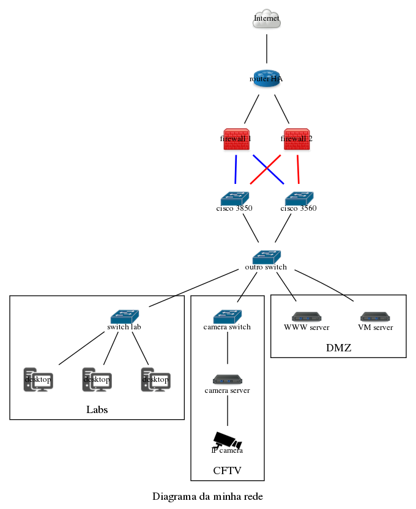
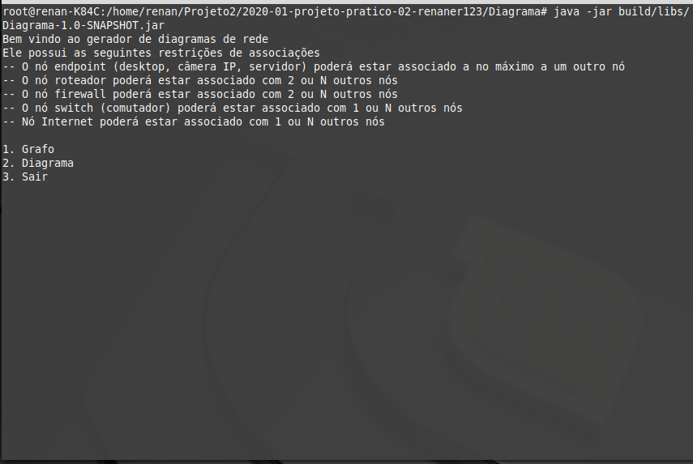
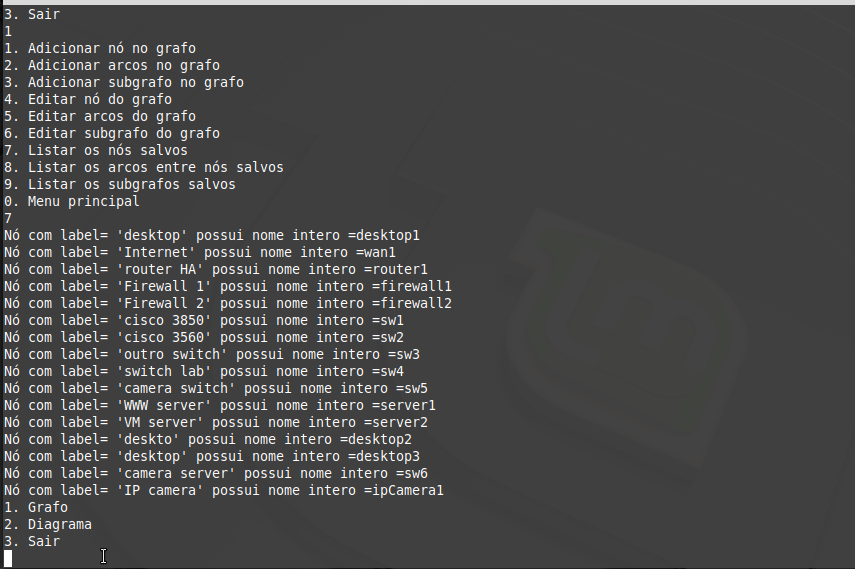
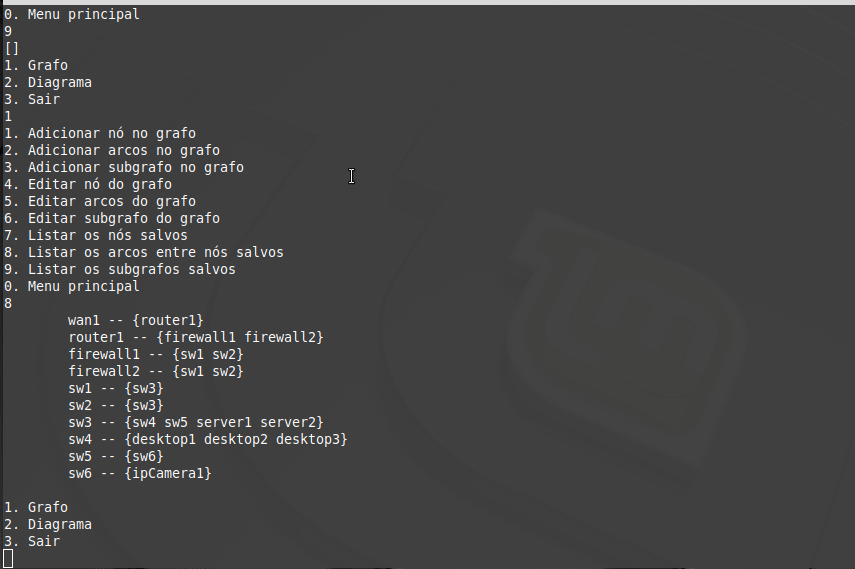
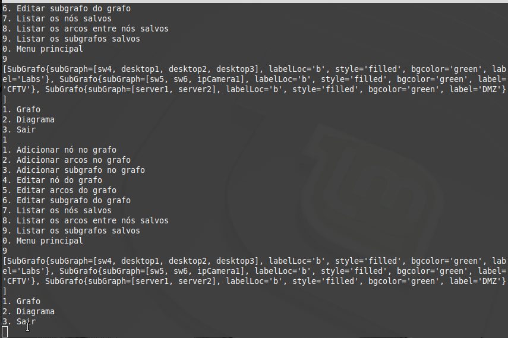
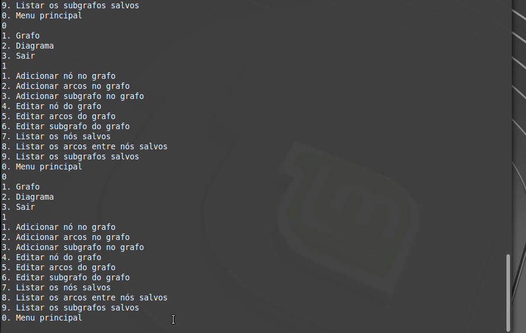
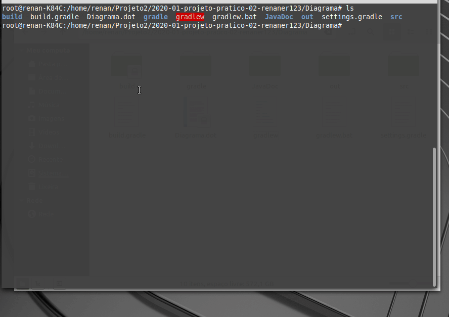

## Desafio proposto. Gerar o diagrama abaixo

> Gerando o diagrama proposto
>
 + Inserindo nós
 
  
   
 + Inserindo arcos
 
  
  
 + Inserindo subgrafo
 
  
  
 + Alterando cor do arco
 
  
  
 + Gerando arquivo .dot
 
  
  
 + Gerando diagrama com Graphviz
 
  