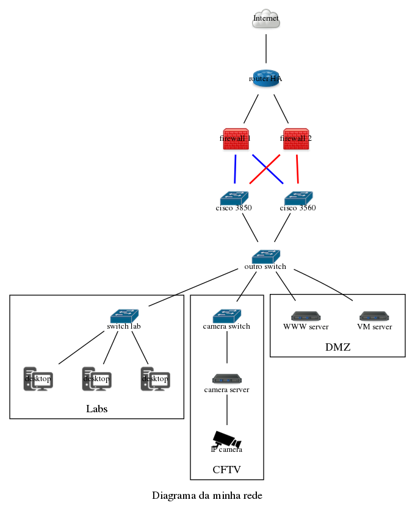

# Gerador de diagramas de redes

Desenvolva um aplicativo em Java que permita criar diagramas de redes, salvá-lo e carregá-lo do disco, além da possibilidade de exportar o mesmo para um arquivo texto, em uma notação de acordo com a [DOT Language](https://graphviz.gitlab.io/_pages/doc/info/lang.html). 

Se o diagrama for exportado para o formato `.dot`, então usuário poderá  usar o comando `dot` (parte do software [Graphviz](https://www.graphviz.org/)) para gerar, por exemplo, uma figura PNG com o diagrama da rede.  Por exemplo:

```shell
dot -Tpng -o diagrama.png diagrama.dot
```

No caso, o `diagrama.dot` será o arquivo texto gerado pelo aplicativo a ser desenvolvido nesse projeto.

Um diagrama de redes é composto por nós (roteadores, nuvem, switch, desktop, servidor, AP, firewall, etc) e arcos entre nós. A figura abaixo mostra um simples diagrama de rede.


A solução deverá garantir que o usuário só faça associações válidas entre os nós, de acordo com as seguintes regras:

-   O nó endpoint (desktop, câmera IP, servidor) poderá estar associado a no máximo a um outro nó
-   O nó roteador poderá estar associado com 2 ou N outros nós
-   O nó firewall poderá estar associado com 2 ou N outros nós
-   O nó switch (comutador) poderá estar associado com 1 ou N outros nós
-   O nó Internet poderá estar associado com 1 ou N outros nós 

Em diagramas de rede o agrupamentos de nós pode ser feito para facilitar o entendimento do mesmo ou ainda para indicar alguma organização lógica dos componentes da rede que está sendo representada. A solução a ser desenvolvida deverá permitir criar tais agrupamentos. 

A figura abaixo mostra um diagrama para representar uma rede que possui dois segmentos: DMZ, onde ficam os equipamentos servidores; e LAN, onde ficam os equipamentos desktop. 


## Entregas

-   Diagrama de Classes UML (arquivo `.png`) na raiz do projeto e referenciado dentro do arquivo `Solucao.md`. A modelagem deverá obrigatoriamente conter herança entre classes.
    -   No arquivo `Solucao.md` deve-se indicar quais funcionalidades foram implementadas e quais não foram
-   Aplicativo com interface que permita a interação com o usuário e por meio dessa o usuário será capaz de criar, modificar e visualizar um diagrama de rede (aplicativo com um menu interativo)
    -   O aplicativo deverá ter uma opção que permita exportar o diagrama no formato de acordo com a DOT Language.
    -   O aplicativo deverá ter uma opção que permita ao usuário persistir em disco o diagrama em um formato próprio (a ser pensando por você)
    -   O aplicativo deverá ter uma opção que permita ao usuário carregar em memória um diagrama a partir de um arquivo em disco (criado pela funcionalidade anterior)
-   Testes de unidade que comprovem que as restrições de associações entre elementos do diagrama de rede estão garantidas
-   Faça uso adequado do `.gitignore`
-   Faça alterações no arquivo `build.gradle` de forma a permitir gerar um JAR executável
-   Garanta que seja possível compilar e executar o código entregue. 
-   Se não for possível executar o código, então o trabalho receberá automaticamente a nota 0.

### Restrições do projeto

A [DOT Language](https://graphviz.gitlab.io/_pages/doc/info/lang.html) é bem complexa e gera grafos não direcionados e grafos direcionados. **Para esse projeto restringa-se somente aos grafos não direcionados**. Grafos, nós e arcos possuem um rico conjunto de atributos, contudo, restringa-se somente àqueles essenciais para fazer um diagrama de rede. 


## Grámatica da DOT Language

Abaixo a gramática abstrata que define a linguagem DOT.

-   Caracteres literais estão dentro de apóstrofos
-   Parênteses indicam grupos de alternativas e o símbolo `|` separa as alternativas. Ou seja, é obrigatório escolher uma das alternativas presentes em um grupo
-   Colchetes indicam itens opcionais

```
graph		: 	[ strict ] (graph | digraph) [ ID ] '{' stmt_list '}'
stmt_list 	: 	[ stmt [ ';' ] stmt_list ]
stmt 		: 	node_stmt | edge_stmt | attr_stmt | ID '=' ID | subgraph
attr_stmt 	: 	(graph | node | edge) attr_list
attr_list 	: 	'[' [ a_list ] ']' [ attr_list ]
a_list 		: 	ID '=' ID [ (';' | ',') ] [ a_list ]
edge_stmt 	: 	(node_id | subgraph) edgeRHS [ attr_list ]
edgeRHS 	: 	edgeop (node_id | subgraph) [ edgeRHS ]
node_stmt 	: 	node_id [ attr_list ]
node_id 	: 	ID [ port ]
port 		: 	':' ID [ ':' compass_pt ] | ':' compass_pt
subgraph 	: 	[ subgraph [ ID ] ] '{' stmt_list '}'
compass_pt 	: 	(n | ne | e | se | s | sw | w | nw | c | _)
```


Abaixo um exemplo em DOT language e sua renderização em PNG logo abaixo:


Abaixo um exemplo com subgráficos para agrupar nós.


Cada nó e arco possui um conjunto de propriedades, que podem ser definidas de forma geral para todos membros de um grafo, ou ainda , redefinidas para cada nó e arco específico. No trecho abaixo é demonstrado como redefinir as propriedades `shape` e `color` para todos os nós do grafo, além da propriedade `color` para os arcos. Por fim, é demonstrado tambem como redefinir as propridades para um nó específico e para um arco.


Abaixo o código para gerar o diagrama de rede presente na primeira figura desse documento. Para esse exemplo, foi fornecido um conjunto de imagens `.png` (disponíveis no diretório [img](img) desse projeto).


Abaixo código usado para gerar o diagrama de rede com segmentação.


#### Desafio

Escreva um arquio `.dot` que permitiria gerar o diagrama de rede apresentado na figura abaixo:




### Alguns atributos de graph / subgraph

-   `label="Título do grafo"`
-   `rankdir=LR` para indicar se o grafo deverá ser gerado da esquerda (L) para direita (R). Por padrão é do topo para baixo. 
-   `style=filled` para indicar que o grafo terá um fundo preenchido com a cor
-   `bgcolor=lightyellow` para indicar que a cor de fundo será amarelo
-   `color=gray50` para indicar que a cor da borda será 50% de cinza

### Alguns atributos de nó

Os atributos de um nó ficam dentro de colchetes, podendo ser separados por espaço ou por `; `

-   `[label="rótulo do nó" labelloc="b" fontsize=10 shape=none image="figura.png" color="red" fillcolor="blue"]` 

### Alguns atributos de arco

`edge [fontsize=11 color=gray50 fontcolor=blue]`, se esse trecho estiver dentro de um grafo, então todos os arcos desse grafo serão na cor 50% de cinza, os rótulos desses arcos estarão na cor azul e com o tamanho da fonte igual a 10.


## Softwares de apoio

-   [Graphviz](https://www.graphviz.org/)
-   [Visual Studio Code](https://code.visualstudio.com/)
    -   Extensões:
        -   [Graphviz Preview](https://marketplace.visualstudio.com/items?itemName=EFanZh.graphviz-preview)
        -   [Graphviz (dot) language support for Visual Studio Code](https://marketplace.visualstudio.com/items?itemName=Stephanvs.dot)


## Referências

-   https://graphviz.gitlab.io/_pages/doc/info/lang.html
-   http://www.graphviz.org/gallery/

-   https://graphs.grevian.org/reference

-   https://renenyffenegger.ch/notes/tools/Graphviz/examples/index

